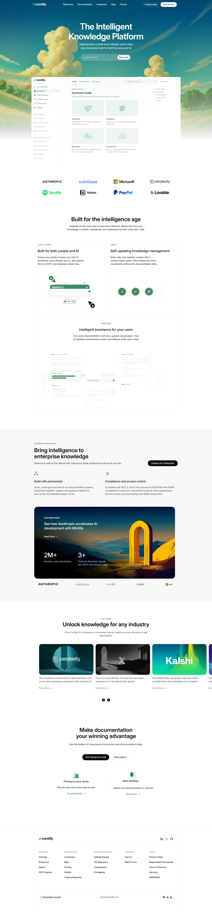

# Mintlify Clone

> This Project is a clone of Mintlify built using HTML and CSS.

---

## Project Preview

<p align="center">
  
</p>

---

## 🛠 Tech Stack

The project is built using the following technologies:

- HTML
- CSS


---
## Recreated Sections Overview

| No. | Section Name                          | Elements Included |
|-----|----------------------------------------|-------------------|
| 1   | Top Navigation Bar                     | Logo, Navigation Links, Primary Call-To-Action Button |
| 2   | Hero Section                           | Main Headline, Short Description, Email Input Field, CTA Button, Large Background Illustration |
| 3   | Documentation Preview Section          | Sidebar-Style Static Navigation, Main Content Cards |
| 4   | Trusted By / Logos                     | Row of Company Logos |
| 5   | Feature Highlights                     | Two-Column Layout (Text + Visual Content) |
| 6   | Intelligent Assistant / UI Preview     | Large UI Mockup with Supporting Description |
| 7   | Enterprise Features Section            | Section Title, Short Introduction, Feature Blocks (Security, Compliance, etc.) |
| 8   | Case Studies / Customer Stories        | Card-Based Layout with Images |
| 9   | Final Call-To-Action                   | Strong Heading, CTA Buttons |
| 10  | Footer                                 | Multi-Column Links, Company Information, Legal Details |


## 📂 Project Structure

```
Mintlify_clone/
│
├── Assets/
├── Assets_white/
├── index.html/
├── styles.css/
└── Result.png
```

## Usage

After running the project locally:
- Open your browser
- Visit `http://localhost:3000` (or your configured port)
- Explore the features

---
